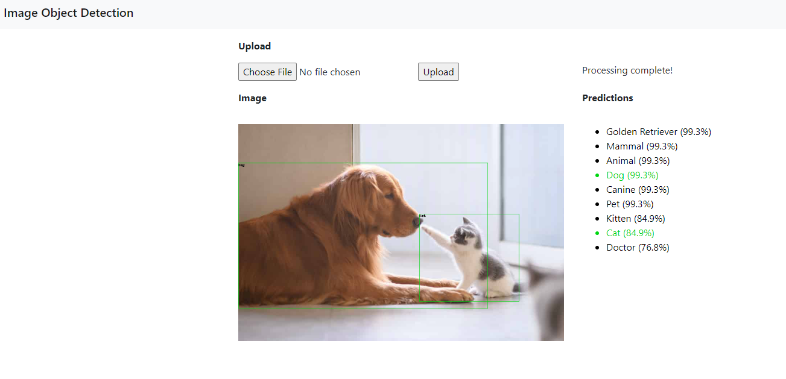
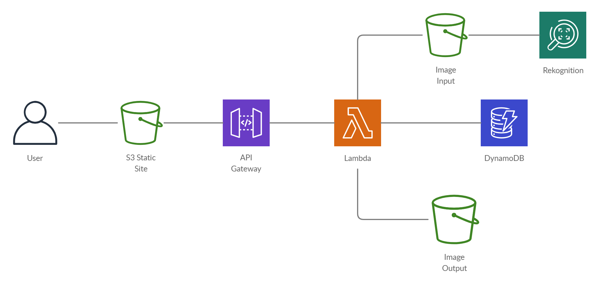

# serverless-image-object-detection

A basic static site that allows users to upload an image and get back the predicted objects in the image. Built on top of S3, Lambda, API Gateway, Rekognition, DynamoDB, and the Chalice framework.




## Setup

Create and activate virtual environment
```
python3 -m venv venv
source venv/bin/activate
```

Install dev dependencies
```
pip install -r dev-requirements.txt
```

This project uses [Terraform](https://www.terraform.io/) to deploy resources to AWS (see [here](https://learn.hashicorp.com/terraform/getting-started/install.html) for installation instructions).

Create a new `terraform/config/backend-env.conf` file from `terraform/config/backend-env.conf.sample` (replace env with either `dev` or `prod`). Similarily, create a new `terraform/config/env.tfvars` file `terraform/config/env.tfvars.sample`.

The Terraform calls are wrapped in [invoke](http://www.pyinvoke.org/) tasks. To deploy, run

```
invoke deploy -e dev
```


If everything is successful, the site should be deployed at

```
http://<site_bucket_name>.s3-website-<region>.amazonaws.com/
```

To cleanup and destroy resources

```
invoke tf-destroy
```
## Architecture


The site is hosted as a static site in an S3 bucket. When a user uploads a file, a POST request is made to API Gateway, which fires off a Lambda (API Gateway is configured to use Lambda proxy integration). The Lambda checks the hash of the file to see if it exists in the input S3 bucket. If it exists, then a prediction was made against the image in the past and we grab the prediction from DynamoDB and the output image from the output bucket. If the image does not exist, then the following series of events happen:

- Get image predictions from Rekognition
- Store predictions in DynamoDB
- Store output image with bounding box in output bucket

Finally, the resulting prediction and output images are sent back and displayed to the client
